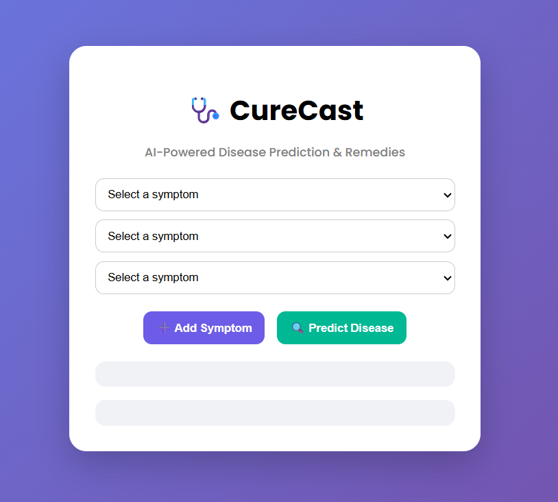
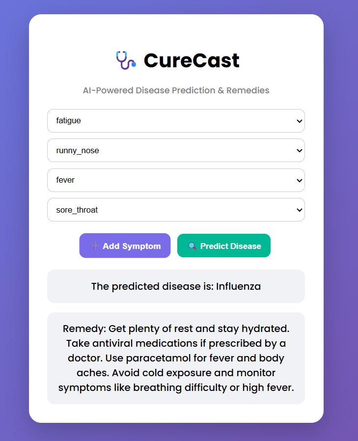

<div align="center">

# 🏥 CureCast
### AI-Powered Disease Prediction & Remedy Recommendation System

[](https://python.org)
[](https://flask.palletsprojects.com)
[](https://scikit-learn.org)
[]()

A machine learning web application that predicts diseases based on symptoms
and recommends home remedies — built with Flask, scikit-learn, and vanilla JavaScript.

</div>

---

## 📸 Screenshots
<div align="center">

&nbsp;&nbsp;

</div>


## 🎯 What does this project do?

- User selects symptoms from a dropdown list
- ML model analyses the symptoms
- Predicts the most likely disease
- Recommends home remedies for that disease
- All in real time with no page reload

---

## 🧠 Model Performance

| Model | Algorithm | Accuracy | Dataset |
|---|---|---|---|
| Disease Classifier | Logistic Regression | 92% | Kaggle Disease-Symptom Dataset |

> The model was trained on 80% of the data and tested on 20% using a fixed random seed for reproducibility.

---

## 🦠 Diseases the Model Can Predict

| # | Disease |
|---|---|
| 1 | Common Cold |
| 2 | Dengue |
| 3 | Influenza |
| 4 | Body Pain |
| 5 | Bronchitis |
| 6 | Fatigue Syndrome |
| 7 | Severe Flu |
| 8 | Viral Fever |

> The model identifies **8 diseases** based on symptoms selected by the user.
> Update this table with the actual diseases from your dataset.
> To find them, add this line temporarily: `print(y.unique().tolist())`

---

## 🛠️ Tech Stack

| Layer | Technology | Purpose |
|---|---|---|
| Backend | Python + Flask | Server and API routes |
| ML Model | scikit-learn | Disease prediction |
| Frontend | HTML + CSS + JavaScript | User interface |
| Data | CSV + JSON | Disease data and remedies |

---

## 📁 Project Structure

---

## ⚙️ How to Run This Project Locally

Follow these steps exactly:

**Step 1 — Clone the repo**
```bash
git clone https://github.com/Ekanshiganglas/CureCast
cd CureCast
```

**Step 2 — Create a virtual environment**
```bash
python -m venv venv
```

**Step 3 — Activate the virtual environment**

On Windows:
```bash
venv\Scripts\activate
```
On Mac/Linux:
```bash
source venv/bin/activate
```

**Step 4 — Install dependencies**
```bash
pip install -r requirements.txt
```

**Step 5 — Run the app**
```bash
python app.py
```

**Step 6 — Open in browser**

## 📦 Requirements

Make sure `requirements.txt` contains:
```
flask
flask-cors
pandas
scikit-learn
```

## 🙋 Author

**Ekanshi Ganglas**
- GitHub: [@Ekanshiganglas](https://github.com/Ekanshiganglas)
- LinkedIn: [www.linkedin.com/in/ekanshi-ganglas]

---

## 🤝 Contributing

Contributions are welcome!
Please read [CONTRIBUTING.md](CONTRIBUTING.md) for guidelines.

---

## ⭐ If you found this useful, please star the repo!